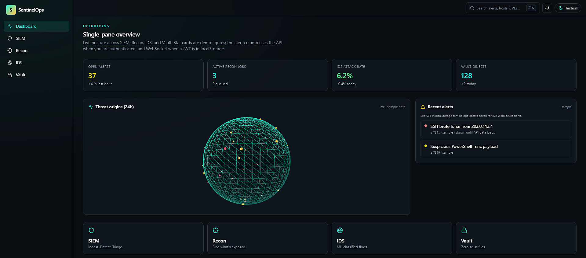
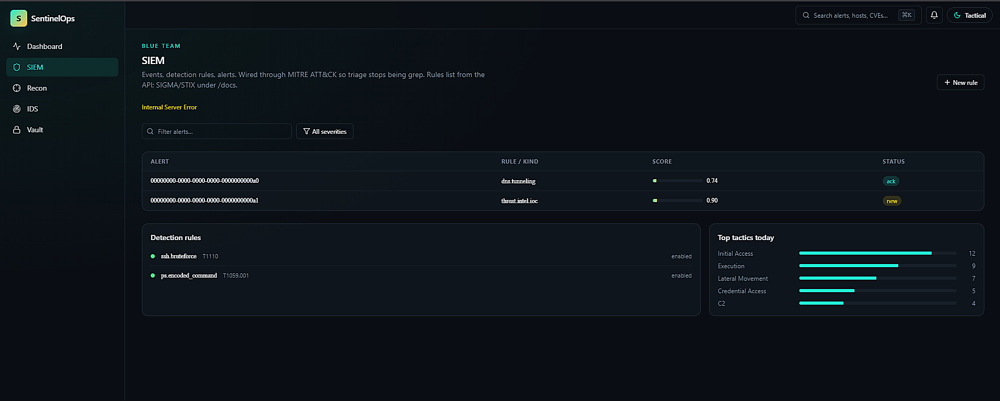
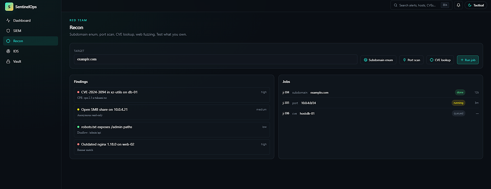
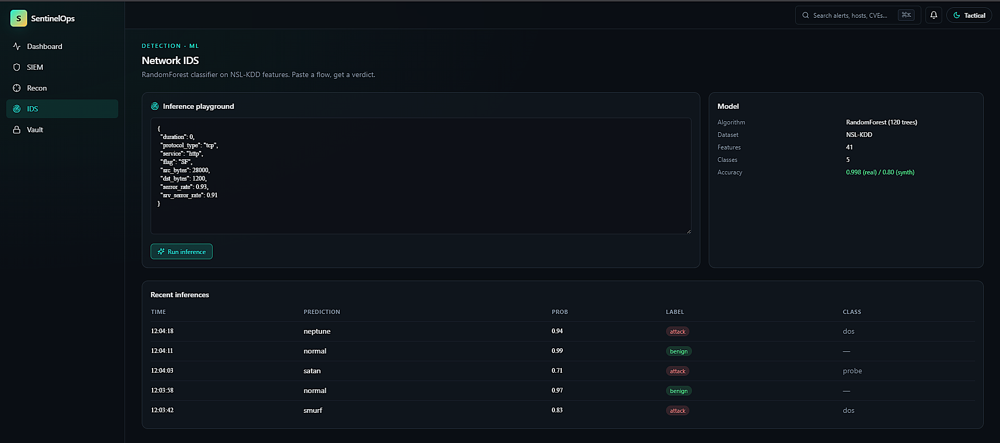

# SentinelOps

A unified security operations platform that folds four very different security disciplines into a single workspace. I built this because every job description I look at wants "full-stack security engineer who also knows ML" and that's really four skill trees at once — so instead of four tiny repos, I made one honest attempt at the whole thing.

It is not a replacement for Splunk, Nessus, Suricata, or a managed KMS. It is a production-oriented reference implementation: real APIs, auth, workers, encryption, audit logging, and clear hardening notes for turning a lab deployment into a responsible service.

## What's in it

**Blue Team SIEM.** Ingest JSON and syslog events, parse them, score them for anomaly with a simple IQR + z-score detector, and map the survivors to MITRE ATT&CK techniques so an analyst can triage by tactic instead of by log line.

**Red Team Recon.** Subdomain enumeration against a resolver, async TCP port scan with service-banner grabs, NVD CVE lookup by CPE string, and a web-path fuzzer with a curated wordlist. Built to be used against targets you own or have written authorisation to test.

**Network IDS with ML.** A RandomForest classifier trained on NSL-KDD, exposed behind a FastAPI inference endpoint. The training pipeline is committed — you can rerun it from scratch — and a pre-fit model artifact ships with the repo so the UI works the moment you run `docker compose up`.

**Zero-Trust Vault.** WebAuthn/passkey authentication (no passwords), envelope encryption with per-user KEKs derived via HKDF, AES-256-GCM for file content, and an append-only audit log hash-chained so tampering is detectable.

## Architecture at a glance

```
┌─────────────────────────── Next.js 16 (App Router) ───────────────────────────┐
│  Dashboard  │  SIEM  │  Recon  │  IDS  │  Vault  │  VAPT  │  Theme  │
│             │        │         │       │         │        │  Tactical / Aurora
└──────┬──────┴───┬────┴────┬────┴───┬───┴────┬────┴───┬────┴────┬───┘
       │          │         │         │         │         │  REST + WS
       ▼          ▼         ▼         ▼         ▼         ▼
┌───────────────────────── FastAPI (Python 3.11) ─────────────────────────────┐
│  /api/v1/siem │ /api/v1/recon │ /api/v1/ids │ /api/v1/vault │ /api/v1/vapt │ auth │
└──────┬──────────────┬──────────────┬──────────────┬──────────────┬──────┘
         │              │              │              │              │
         ▼              ▼              ▼              ▼              ▼
   Postgres        Celery workers     scikit-learn   AES-GCM +     JWT +
   (events,        (recon jobs,       model artifact HKDF          WebAuthn
    alerts,         long scans)        (ml/artifacts)
    audit)
         └──────────────┬──────────────┘
                        ▼
                      Redis
              (broker + cache + pub/sub)
```

The modules share auth, the event bus, the audit log, and the UI shell. Feature areas are isolated — you can delete a module package and the rest keeps running, within dependency limits.

## Running it

You need Docker and Docker Compose. That's it.

```bash
git clone https://github.com/Vyrnexis-e16s/sentinelops.git
cd sentinelops
cp .env.example .env
make up
```

Then:

- UI at http://localhost:3000
- API docs at http://localhost:8000/docs
- Default dev user: `analyst@sentinelops.local` / passkey registered on first visit

`make seed` loads deterministic development telemetry and known-bad CVE examples so local dashboards can be verified without connecting external agents.

### Automated setup (Windows & Linux)

Use the scripts in [`scripts/`](scripts/) to create Python **venv**s (`backend/.venv`, `ml/.venv`), install **requirements.txt**, install **Node** dependencies, run **TypeScript** + **ESLint** checks, optionally start **Docker** Compose, and log everything under `logs/`.

- **Windows (PowerShell):** `.\scripts\sentinelops-dev.ps1` — see [`scripts/README.md`](scripts/README.md) for `-Mode` and `-TryUpgradePython`.
- **Linux / Ubuntu / WSL:** `chmod +x scripts/sentinelops-dev.sh && ./scripts/sentinelops-dev.sh` — the default `MODE=full` needs Docker running; `MODE=local` only prepares venvs/Node without compose. `SENTINELOPS_APT_INSTALL=1` on Ubuntu installs Python 3.12 + venv via apt (requires sudo).

### Optional: local LLM (Ollama) for VAPT

The **VAPT** view can call a **local** model through an OpenAI-compatible API ([Ollama](https://ollama.com) is the default path in-repo). You must **install Ollama first**; if `./scripts/sentinelops-dev.sh --setup-llm` or `setup-local-llm` reports *“Ollama is not on PATH”*, install it, then **open a new shell** (or `hash -r`) so `ollama` is on `PATH` — the installer often puts the binary in `/usr/local/bin`.

| Platform | Install Ollama |
|----------|----------------|
| **Linux** (Kali, Ubuntu, Debian, Fedora, etc.) | Official install: run the `curl` command from [ollama.com](https://ollama.com) (it downloads and runs `install.sh` with `sh`). You get a systemd service, the `ollama` binary under `/usr/local`, and the API on `http://127.0.0.1:11434` (root/sudo for service install). See [Ollama’s Linux doc](https://github.com/ollama/ollama/blob/main/docs/linux.md). |
| **Windows** | **Native Windows:** [Download the installer](https://ollama.com/download) and run it (Ollama runs in the system tray; API on `127.0.0.1:11434`). **WSL only:** do **not** use the Windows GUI installer for a Linux shell — use the same **Linux** `install.sh` **inside** WSL, or use Ollama for Windows and point the API in `.env` at the right host. |

**After Ollama is installed and the `ollama` command works:** from the repo root run `./scripts/sentinelops-dev.sh --setup-llm` (Linux/macOS) or `.\scripts\setup-local-llm.ps1` (Windows), merge the generated `.env.llm.local.generated` into your `.env`, and restart the API. **Full** variable list, two-model **draft + refine** cascade, Docker-Compose host access, and troubleshooting: [`docs/LOCAL_LLM.md`](docs/LOCAL_LLM.md) (also linked from [`.env.example`](.env.example) and [`scripts/README.md`](scripts/README.md)).

## Portfolio proof (screenshots)

Screenshots are stored as PNGs in [`docs/images/`](docs/images/). For best results, capture **after** `make up` and `make seed`, while signed in (or with a dev JWT) so the API-backed panels are populated. Optional extras you can add the same way: `05-vault.png` (`/vault`), `06-api-docs.png` (`http://localhost:8000/docs`), `07-metrics.png` (`/metrics` with `EXPOSE_PROMETHEUS=true`), `08-command-palette.png` (⌘K / Ctrl+K on any page), `09-themes.png` (Tactical vs Quantum Aurora).

**How to get a JWT for real UI data:** use **Authorize** in Swagger on `http://localhost:8000/docs` after registering a passkey, or run WebAuthn from the app and copy the token into `localStorage` as `sentinelops_access_token` (or set `NEXT_PUBLIC_DEV_TOKEN` in `.env.local` for local only).

### Current captures

| View | Screenshot |
|------|------------|
| Dashboard |  |
| SIEM |  |
| Recon |  |
| IDS |  |

## Developing without Docker

The **frontend** uses **Next.js 16** and needs **Node.js 20.9+** (the repo’s Docker/CI use Node 22).

```bash
# Backend
cd backend
python -m venv .venv && source .venv/bin/activate
pip install -r requirements.txt
uvicorn app.main:app --reload

# Frontend
cd frontend
corepack enable && pnpm install   # or: npm install
pnpm dev

# ML (retrain)
cd ml
pip install -r requirements.txt
python scripts/train_ids.py
```

## Two UI variants

The frontend ships with two themes that swap at runtime. Both use the same component primitives — the only difference is CSS variables and which background layer mounts.

- **Tactical Night** — graphite base, neon teal and amber accents, glass panels, JetBrains Mono for data. Includes a Three.js 3D globe of threat origins and a subtle scanline overlay. Feels like a NOC at 2am.
- **Quantum Aurora** — midnight-blue-to-violet gradient, aurora WebGL particle field, rounded cards with gradient borders, spring-physics hover states. Feels like a premium product.

Theme choice persists per-user. The shader-heavy components (`<Globe />`, `<AuroraCanvas />`) are lazy-loaded so the initial paint stays fast.

## Testing

```bash
make test          # runs backend pytest + frontend vitest + ml pytest
make test-e2e      # Playwright smoke tests against a docker-compose stack
make lint          # ruff + black --check + mypy + eslint + tsc --noEmit
```

CI runs the same commands on every push and on pull requests into `main`.

## What I'd do next

This repo is a **production-oriented security platform reference**: real module APIs are implemented, while commercial-scale gaps and future integrations are tracked openly. Production hardening guidance is in [`docs/PRODUCTION.md`](docs/PRODUCTION.md), and the detailed backlog is in [`docs/ROADMAP.md`](docs/ROADMAP.md).

**Shipped in-tree (v1+ extensions)** include: a **limited Sigma → rule DSL** compiler (`POST /api/v1/siem/sigma/compile`), **STIX indicator ingest** and **IOC enrichment** on event ingest, a **WebSocket** alert stream at `/ws/alerts?token=`, a **per-source UEBA-style** volume summary, **case investigations** CRUD, **Prometheus** metrics at `/metrics` when enabled, an IDS **drift** summary and **explanation proxy** (tree feature importance) on inference, a **command palette (⌘K)** on the UI, a **VAPT command** view at `/vapt` with **live** roll-up from Postgres (`GET /api/v1/vapt/surface`), **optional** OpenAI-compatible **LLM triage** (`POST /api/v1/vapt/llm/summarize` when `OPENAI_API_KEY` is set — otherwise HTTP 503 with setup text, no fake summaries), and **saved briefs** in `vapt_briefs` per user.

Remaining themes: full Sigma parity, a real TAXII **client** with scheduling, distributed recon workers, OIDC, multi-tenant RLS, HSM, PQC, on-prem LLM (vLLM) automation beyond single-shot triage, Neo4j, eBPF, Helm/Terraform, and more — all expanded in the roadmap.

## Legal and ethical use

**Read this before running anything.** SentinelOps contains offensive security tooling — port scanners, subdomain brute-forcers, and a web path fuzzer — bundled with the defensive pieces. Those capabilities are there so you can practise the full attacker-defender loop in a lab you own. They are **not** a licence to test networks you don't own.

- Only run the `recon` module against hosts, domains, and IP ranges that you own, that your employer has contracted you to test, or for which you hold explicit written authorisation (a bug-bounty program in-scope list counts, out-of-scope does not).
- Unauthorised scanning, credential harvesting, or traffic interception against third-party systems is illegal in most jurisdictions (CFAA in the US, Computer Misuse Act in the UK, IT Act in India, etc.) — getting caught is on you.
- The Vault uses real envelope-encryption primitives, but production secrets, PII, or regulated data still require a reviewed deployment, operational key management, and preferably an HSM/KMS-backed master key.
- The ML IDS model is trained on NSL-KDD, which is a teaching dataset with well-known coverage gaps. It is **not** a substitute for a commercial IDS on a real network.
- This software is provided **"AS IS"**, without warranty of any kind (see the Apache 2.0 `LICENSE` file for the formal language). The authors and contributors accept no liability for damage, downtime, legal trouble, or any other consequence arising from your use of this code. You are the sole responsible party for how, where, and against what you run it.

If any of the above is unclear, stop and get advice before running the tool — don't guess.

## Security

If you find a vulnerability, please see [SECURITY.md](SECURITY.md) for disclosure. Don't open a public issue.

### Dependency audits (frontend / pnpm)

The frontend is managed with **pnpm** (see `packageManager` in `frontend/package.json`); CI uses the same. **`package.json` `overrides`** pin **one** `react` / `react-dom` 19, matching `@types/*`, and safe **PostCSS** (including under `next`). That avoids duplicate `react@18` from **cmdk**’s Radix tree and the resulting `ERESOLVE` / peer warnings. If you still see them or stale audits, **delete** `node_modules` and the lock you use, then reinstall.

```bash
cd frontend
# clean tree (if upgrading or ERESOLVE persisted):
# rm -rf node_modules
# (optional) del package-lock.json  # or remove pnpm-lock.yaml when switching managers
corepack enable
pnpm install
pnpm audit
```

Avoid `npm audit fix --force` on this app; it can suggest wild downgrades. Prefer editing `package.json` (including the `overrides` block) and running `pnpm install`, then `pnpm typecheck`, `pnpm lint`, and `pnpm build`.

Optional (Python backend, same machine):

```bash
cd backend && . .venv/bin/activate  # or your venv
pip install pip-audit && pip-audit -r requirements.txt
```

## License

Apache License 2.0 — see [LICENSE](LICENSE) and [NOTICE](NOTICE). The Apache 2.0 license grants you broad rights (commercial use, modification, distribution, sublicensing) in exchange for retaining attribution and the license notice, and it includes a patent grant that MIT does not. It also ships with an explicit **Disclaimer of Warranty** and **Limitation of Liability** — how you use this project is entirely your responsibility (see the section above).

## Acknowledgements

- NSL-KDD dataset curators at the University of New Brunswick.
- MITRE ATT&CK for the technique taxonomy.
- The shadcn/ui, Framer Motion, and Three.js communities.
